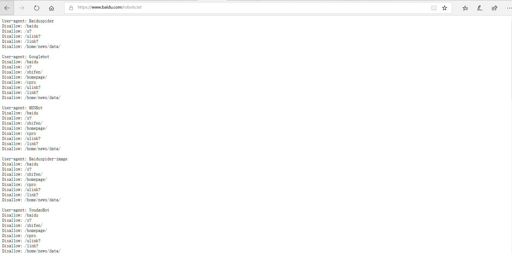

# Alexa全球排名top 10000的站点网络服务信息收集实验

## 一.网络收集：

### 1.敏感信息外泄：

**来自百度官方的信息：**


**robots.txt：**

baidu禁止的爬虫：



**网站备份压缩文件：**

例：乌云漏洞：wooyun-2014-050622百度网盟漏洞

在url域名后加上tar.gz可以直接下载部分源码。漏洞原因：网站进行备份的时候将压缩包放在了web没有设置访问权限的目录下，导致源码泄露

目前没有找到相关压缩文件。

**.git/.svn版本记录：**

尚未找到。

### 2.搜索引擎：

**维基百科：**


**Google Hacking：**（bing搜索语法相似）

见Google Hacking markdown

**zoomeye：**

依旧有功能强大的自定义语句查询功能，但是基本上直接查询：

```
site:baidu.com
```

就可以了。报告可以直接下载。


**佛法fofa：**fofa搜索语法：和google类似，增加筛选条件和查询


**天眼查：**


### 3.其他工具辅助：

**whois：**

查询到解析该域名的服务器有五个：

DNS.BAIDU.COM

NS2.BAIDU.COM

NS3.BAIDU.COM

NS4.BAIDU.COM

NS7.BAIDU.COM

注册商：

MarkMonitor公司

注册商投诉邮箱：

abusecomplaints@markmonitor.com


**dig：**（nslookup同理）

请求段：baidu.com

TTL：67跳（？）

响应段：显示baidu.com的域名IP地址

返回多个IP地址，显示baidu.com存在内容分发网络(CDN)

也可以通过MySSL网站来进行检测：


递归查询域名：baidu域名解析服务器如下图所示。

```
dig +trace baidu.com
```


别名CNAME：非权威应答


**站长之家:**


## 二.参考资料及总结：

检测WAF应用防火墙及其他防御措施，因为老师明确了不能使用工具进行扫描等行为，没有尝试。

CSDN：从dig命令理解DNS：https://blog.csdn.net/a583929112/article/details/66499771

谈谈源码泄露 · WEB 安全：https://gitbook.cn/books/5a45cb9e6c98266501c3a4cd/index.html


