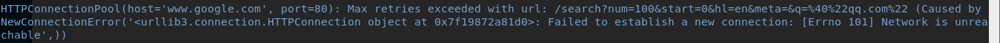
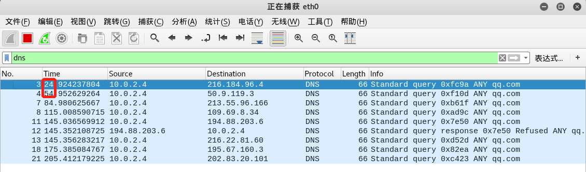

### DNS 枚举工具及方法总结

#### BASIS

- **浏览器地址栏输入域名**

  - 浏览器检查域名是否在缓存中 (比如，查看 Chrome 当中的缓存, 打开 chrome://net-internals/#dns)
  - 若缓存中没有, 就去调用 gethostbyname 库函数 (操作系统不同函数也不同) 进行查询
  - gethostbyname 函数在试图进行 DNS 解析之前首先检查域名是否在本地 Hosts 里
  - 若本地的 hosts 文件没有这个域名的缓存记录，且 gethostbyname 未找到，它会向 DNS 服务器发送一条 DNS 查询请求。
  - 接下来就是 DNS 查询的过程

- **zone transfer 过程**

  

  ​	[1]  目标服务器向源服务器发出查询 SOA 查询的请求。因为目标服务器总是区域的辅助服务器，不能自定义主要服务器。

  ​	[2] 源服务器给出SOA查询请求应答，告诉目标服务器SOA中配置的主服务器地址，也就是SOA资源记录。

  ​	[3] 目标服务器向主要DNS服务器发送初始“所有区域”传送(AXFR)区域传输请求。

  ​	[4] 源服务器作出响应，并将此区域完全或者增量区域信息传送到辅助（目标）服务器。传输内容中同时包括了源服务器中的SOA配置的序列号，以阻止循环复制。SOA资源记录中也包含一个以秒为单位的状态刷新间隔（默认设置是900秒或15分钟），指出目标服务器下一次应在何时请求使用源服务器来续订该区域。刷新间隔到期时，目标服务器再次使用SOA查询来请求从源服务器续订此区域。源服务器应答其SOA记录的查询。该响应包括该区域在源服务器中的当前状态的序列号。

  ​	[5] 目标服务器检查响应中的SOA记录的序列号，并确定怎样续订该区域。如果SOA响应中的序列号值等于其当前的本地序列号，那么得出结论，区域在两个服务器中都相同，并且不需要区域传输。然后，目标服务器根据来自源服务器的SOA响应中的该字段值重新设置其刷新间隔，来续订该区域。如果SOA响应中的序列号值比其当前本地序列号要高，则可以确定此区域已更新并需要传送。如果这个目标服务器推断此区域已经更改，则它会把IXFR查询发送至源服务器，其中包括此区域的SOA记录中序列号的当前本地值。

  ​	[6] 源服务器通过区域的增理传输或完全传送作出响应。如果源服务器通过对已修改的资源记录维护最新递增区域变化的历史记录来支持递增传送，则它可通过此区域的递增区域传输(IXFR)作出应答。如果源服务器不支持递增传送或没有区域变化的历史记录，则它可通过其他区域的完全(AXFR)传送作出应答。


#### Step 1 使用常用的枚举工具

- **搜索引擎枚举**

  - 直接使用 google 的 site: 搜索子域名 ( 也可以用 Bing , 百度 )

    ```
    site:qq.com
    ```

    

    46,600,000 并不代表 qq 有这么多子域名, 其中有很多重复的域名, 也包含一些泛解析子域名, 导致结果集如此庞大。

  - 使用 theharvester 搜索

    ```
       -d: Domain to search or company name
       -b: data source: baidu, bing, bingapi, dogpile, google, googleCSE,
                        googleplus, google-profiles, linkedin, pgp, twitter, vhost, 
                        virustotal, threatcrowd, crtsh, netcraft, yahoo, all

       -s: Start in result number X (default: 0)
       -v: Verify host name via dns resolution and search for virtual hosts
       -f: Save the results into an HTML and XML file (both)
       -n: Perform a DNS reverse query on all ranges discovered
       -c: Perform a DNS brute force for the domain name
       -t: Perform a DNS TLD expansion discovery
       -e: Use this DNS server
       -l: Limit the number of results to work with(bing goes from 50 to 50 results,
            google 100 to 100, and pgp doesn't use this option)
       -h: use SHODAN database to query discovered hosts
    ```

    KALI 下 `theharvester` 的 `-b` 参数选择 `google` 时会报错, 这里选用 Bing。输入以下命令, 返回结果:

    

    ```
    theharvester -d qq.com -l 500 -b bing
    ```

    

    没有返回结果。这个时候 Bing 和 Google 就没有 Baidu  好用了 , 输入以下指令:

    

    可能会有一些用户的邮箱 , 简单处理了一下:

    

    


- **HTTPS 证书透明度报告**

  ​	Google透明度报告中的[证书透明度项目](https://transparencyreport.google.com/https/certificates)是用来解决HTTPS证书系统的结构性缺陷，它能够让所有人查询各个网站的HTTPS证书信息，从而能发现签发了证书的子域名。打开 google 输入网址:

  

  

  查看返回的结果:

  

  这些是签发方的信息汇总。

  

  上图中的 `主题` 包含了一部分子域名 , `DNS名称数量` 表明获得该 CA 签发证书的 DNS 数量, 同时还能观察到相同的主题下有不同的 DNS 名称数量 。可以点击右侧的 `查看详情` 查看详细的信息:

  

  可以看到 DNS names 的二级域名都是不同的 , 但是三级域名都是相同的。关于上图中的 `主题` 和 `DNS names` 之间的关系 , 我不是很清楚 , 只能猜测 `DNS names` 是一个集合 , `主题` 是选择这些集合中出现频率最高的元素( 未解决 )。在 透明度报告中 , 还能观察到泛解析域名:

  

  有了透明度报告, 要找到所有子域名, 只要将所有的 `查看详细信息` 页面中的 `DNS names` 去重即可。但是这种方法也可能存在一些遗漏的情况( 只能想到这么多......):

  - 公司内部使用并不向用户开放 DNS 服务器
  - HTTP 协议实现的 DNS 服务器 (不需要注册证书)


- **crt.sh | Certificate Search**

  

  通过这个网站搜索证书信息 ( 不知道这个和上面哪个信息更准确......) 。随便点开一个 ID 查看内容信息, 显示了完整的证书信息, 截图如下:

  


- **Censys.io**

  Censys.io是scans.io所发布的数据子集的访问接口，它可以通过证书中的关键字来进行搜索，而这通常会帮助我们搜索出新的子域名:

  


- **DNS zone transfer (DNS 域传输) 利用**

  - dig 向 DNS 服务器发送 AXFR 请求(一般只能拷贝一级和二级 DNS 服务器内容):
    
    ```
    dig @8.8.8.8 qq.com AXFR
    ```

    

    观察数据包:

    

    查阅资料知 , 网络管理员禁止服务器接收来自未认证DNS服务器的AXFR请求 , 会导致 AXFR 请求失败。

  - **使用在线网站进行 AXFR 请求**

    访问网站:

    ```
    https://hackertarget.com/zone-transfer/
    ```

    截图如下:

    

    ​		AXFR 请求还是失败的。但是比在命令行中输入 dig 得到的信息更多: 
    ​		(1) 得到 ns1 ~ ns4 name server 信息 
    ​		(2) 每次 axfr 请求都会有 n 个 severs found ( 比 dig 多一些...)

    ​		总体上说 , AXFR 得到的信息比起之前的方法少了很多, 在该应用场景下并不是很合适。


- **Cymon 查询域名**

  


- **VirusTotal 查询域名**

  VirusTotal的 search 可以查询域名 , 结果如下:

  

  KALI 上 whois 测试一下:

  

  得到了 zone transfer test online 上面的 ns1~ ns4 的信息。nslookup 也测试了一下, 这里就不再截图。除此之外, VirusTotal 还返回如下信息:

  

  点击 `More` 可以查看更多的信息。简单统计了一下 (不断点开 `More`), 发现共有 100 个子域名(不知道是不是只列出了 100 个......) 


- **DNSdumpster 查询**

  DNSdumpster 网址如下:

  ```
  https://dnsdumpster.com/
  ```

  个人感觉 DNSdumpster 的内容更丰富 , 不仅列出主机名和 IP , 而且还进行了分类(DNS Servers、MX Records、TXT Records、Host Records (A)), 甚至列出服务器的系统系列、地理位置。

  

  

  简单地数了一下, 统计信息中共有 127 个域名。


- **子域名枚举**

  **子域名的枚举主要关注的一些问题**:

  (1) 线程或模式的使用会影响枚举速度

  (2) 字典的大小会影响枚举的结果数量 , 同时影响枚举的速度

  (3) 字典的自生成算法会减少字典的大小 , 同时消耗更多的时间

  (4) 程序的设计影响枚举结果的准确性 (是否能合适地处理一些特殊情况)

  (5) 不同的域名服务器可能会有不同的解析结果


  - 使用进行简单的 DNS 查询:

    ```
    nslookup qq.com
    dig qq.com any
    ```

    

  - **dnsmap**

    help 文档:

    ```
    options:
    -w <wordlist-file>
    -r <regular-results-file>
    -c <csv-results-file>
    -d <delay-millisecs>
    -i <ips-to-ignore> (useful if you're obtaining false positives)
    ```

    简单地查看了一下 dnsmap 自带的字典 `dnsmap.txt` , 截图截图如下:

    

    ```
    cd /usr/share/wordlists
    cat dnsmap.txt
    ```

    

    三位 , a =>z , 共有 26^3 = 17576 种组合。大概没有比这还简陋的 wordlist 了...... dnsmap 跑一下(默认使用 dnsmap.txt):

    ```
    dnsmap qq.com
    ```

    

    上述指令没有设置 `-d` , maximum random delay 是 10 millisecond (1 s 100个请求) , 而且根据 wireshark 抓包的结果, 一直都是 request => reply => request ....... 显然, 程序是单线程的 , 大致的逻辑 : `发送 DNS request` => `收到 DNS reply` => `解析 DNS reply` => `解析结果显示到命令行` (如果是 python , requests + bs4 大概就行了吧 ...) 。大致估算一下间隔时间 , 大概需要 3 min ( 17576 /100 * 0.5 ) , 这里还没有算上 查询过程消耗的时间 ...... (立刻中止了程序 , 没有等到实验结果......)


  - **SubBrute** 

    KALI 并未自带 subbrute , 需要手动下载:

    ```
    git clone https://github.com/TheRook/subbrute.git
    ```

    [github](https://github.com/TheRook/subbrute)  上的一些介绍:

    > ### More Information
    >
    > names.txt contains 101,010 subdomains. subs_small.txt was stolen from fierce2 which contains 1896 subdomains. If you find more subdomains to add, open a bug report or pull request and I'll be happy to add them.

    命令行中输入以下指令:

    ```
    ./subbrute.py qq.com
    ```

    返回结果如下, 左边的 wireskark 显示正在正常工作 , 但是右边的命令行中并没有回显结果:

    

    简单看一下 , 默认 30 秒发送一个 DNS 请求:

    

    ```
    Options:
      -h, --help            show this help message and exit
      -s SUBS, --subs=SUBS  (optional) A list of subdomains, accepts a single
                            file, or a directory of files. default = 'names.txt'
      -r RESOLVERS, --resolvers=RESOLVERS
                            (optional) A list of DNS resolvers, if this list is
                            empty it will OS's internal resolver default =
                            'resolvers.txt'
      -t TARGETS, --targets_file=TARGETS
                            (optional) A file containing a newline delimited list
                            of domains to brute force.
      -p, -P                (optional) Print data from found DNS records (default
                            = off).
      -o OUTPUT, --output=OUTPUT
                            (optional) Output to file (Greppable Format)
      -j JSON, --json=JSON  (optional) Output to file (JSON Format)
      --type=TYPE           (optional) Print all reponses for an arbitrary DNS
                            record type (CNAME, AAAA, TXT, SOA, MX...)
      -c PROCESS_COUNT, --process_count=PROCESS_COUNT
                            (optional) Number of lookup theads to run. default = 8
      -v, --verbose         (optional) Print debug information.
    ```

    简单地查看一下参数 , 发现没有更改间隔时间的参数 , 但是可以改变进程数量, 输入以下指令:

    ```
    ./subbrute.py qq.com -c 100
    # 如果用 1000 会报warning,提示每个进程分配了不到 16 个 DNS names,因此这里用 100 ( 16 < 1896 / 100 )
    ```

    

    6 min 不到 30 个 request , 平均一分钟不到 5 个, 这里暂时先停一下, 看看有没有更快的工具。


  - **dnsenum** 

    输入以下指令:

    ```
    dnsenum --f /usr/share/golismero/wordlist/dns/subbrute_small.txt
    ```

    返回结果如下:

    

    ```
    cat /usr/share/perl5/Net/DNS/Question.pm -n 
    ```

    

    这段代码不是很明白......


  - **sublist3r**

    sublist3r 在 KALI 中需要手动安装:

    ```
    apt-install install sublist3r
    find / -name '*subbrute*'
    ```

    

    首先简单地查看一下自带的字典:

    

    ```
    cat /usr/share/golismero/wordlist/dns/all.txt
    cat /usr/share/golismero/wordlist/dns/subbrute_large.txt
    cat /usr/share/golismero/wordlist/dns/subbrute_small.txt
    ```

    发现结果也没有什么不同 , 这里就不再截图。关于这三个字典的区别 , 内容上不能区分 , 只能从`词的数量`上来考虑, 输入以下指令:

    ```
    wc -l /usr/share/golismero/wordlist/dns/subbrute_large.txt
    wc -l /usr/share/golismero/wordlist/dns/subbrute_small.txt
    wc -l /usr/share/golismero/wordlist/dns/all.txt
    ```

    结果如下:

    

     large.txt 的词数有 404994 条 , small.txt 的词数有 12044 条, all 的词数有 407650 条 , 数量上很符合常理。提出猜想: all.txt 是由 large.txt 和 small.txt 求交集后去重得到。输入以下指令验证 ( 为了防止文件名过长提前 cd 到目标目录下):

    ```
    sort subbrute_large.txt subbrute_small.txt | uniq | wc -c
    ```

    返回结果如下:

    

    正好等于 all.txt 中词的数目, 猜想成立。同时得知 , small.txt 中的词不是完全由 large.txt 组成 , 输入以下指令查看 large.txt 和 small.txt 的差集:

    ```
    sort subbrute_large.txt subbrute_small.txt subbrute_large.txt | uniq -u
    ```

    返回结果如下:

    

    最后还是不明白它是这么分的 large.txt 和 small.txt ...... ( 后来发现这个目录是KALI 自带的 golismero 中的wordlist......)

    用 sublist3r 测试一下, 输入以下指令:

    ```
    python sublist3r.py -d qq.com -t 15
    ```

    返回结果如下:

    

    显示结果共有 703 条。


  - **firece**

    ​	fierce 是使用多种技术来扫描目标主机IP地址和主机名的一个DNS服务器枚举工具。运用递归的方式来工作。它的工作原理是先通过查询本地DNS服务器来查找目标DNS服务器，然后使用目标DNS服务器来查找子域名。fierce的主要特点就是可以用来地位独立IP空间对应域名和主机名。

    在命令行中输入下面指令:

    ```
    fierce -dns qq.com -f /usr/share/golismero/wordlist/dns/all.txt -threads 15
    ```

    返回结果:

    


#### 参阅

- [AXFR和IXFR区域传输及原理](https://blog.csdn.net/homedesk/article/details/77989241)
- [子域名枚举的艺术](https://www.cloudxns.net/Support/detail/id/2933.html)
- [使用Kali Linux在渗透测试中信息收集](https://www.freebuf.com/articles/system/58096.html)
- [wiki dns](https://en.wikipedia.org/wiki/Domain_Name_System#DNS_Protocol_transport)
- [Pentest Box Tools](https://tools.pentestbox.org/)
- [Sublist3r](https://tools.kali.org/information-gathering/sublist3r)

- [dnsmap](https://github.com/makefu/dnsmap)
