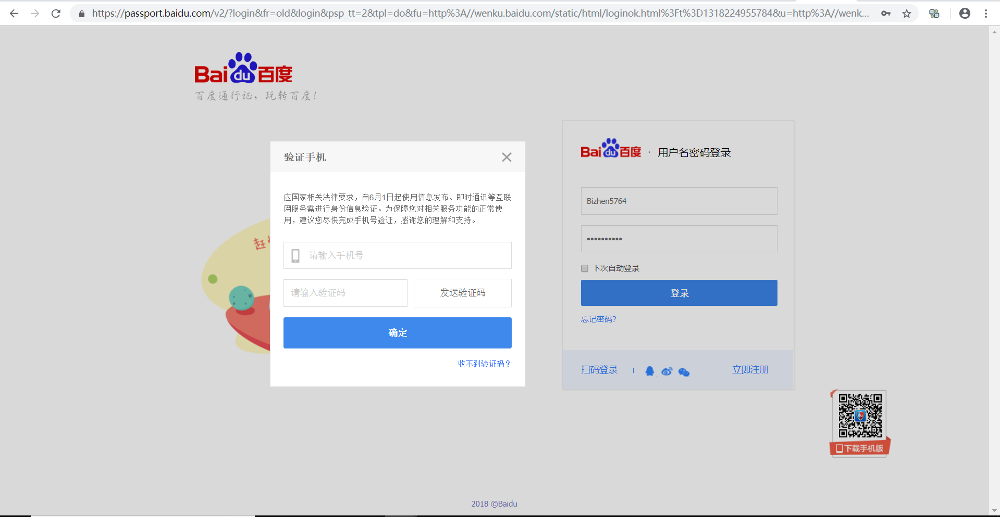
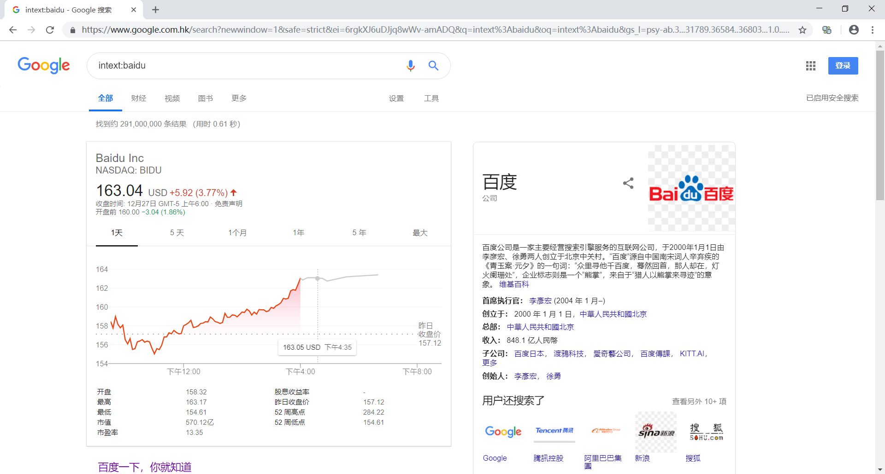

# Google Hacking

##  一.Exploit Database:

选自最近发布的GHDB，Exploit Database

**1.管理员账号登陆页面Admin Login Page :**

未搜索到百度管理员账号登陆页面。

```
inurl:admin.php inurl:admin ext:php
```

**2.用来寻找登陆站点：**

国外常用登陆站点实例：用户名：jane.citizen1。没有搜索到百度相关页面。

```
"Example: jane.citizen1"           
```

**3.寻找登陆站点:**

依旧没有找到相关登陆页面。

```
intext:"EQ1PCI"
```

**4.Find Username and Password Combo Login Information:**

寻找密码和账户的文本：

```
intext:password "Login Info" filetype:txt
```

在一个医药网站上的wp-content目录下，有一个上传的目录uploads，里面不知道为什么记录了1password的一个记录密码的文本1Password-text-file.txt，基本上所有的网站的账号密码都存在这个txt中ctrl F：find Baidu在全页面搜索得到一个百度网盘的账户名和密码：可以登陆进去，为了不触犯法律法规。没有进行进一步操作。



5.Search:

各式各样的软件注册码和软件破解的文本搜索，没有搜索到baidu相关的软件（baidu本身也没有什么付费正版软件，但是基本上别的软件例如adobe和windows都可以搜索到）

```
filetype:txt "Registration Code"
```

6.This Google Dork discovers thousands of login portals:

查找登陆页面

```
"login":
```

百度云账号和百度账号都可以通过搜索：

```
"login:" site:baidu.com
```

获得。

7.discover cpanel login portals for Neto eCommerce suite users:

搜索后发现是忘记密码后通过Neto账号找回密码的页面，和百度没有什么关系。

```
inurl:_cpanel/forgotpwd
```

8.will show you admin page, no login needed:

不需要登陆进入管理员页面。

```
intitle:ProFTPD Admin - V1.04
```

## 二.普通谷歌搜索：

