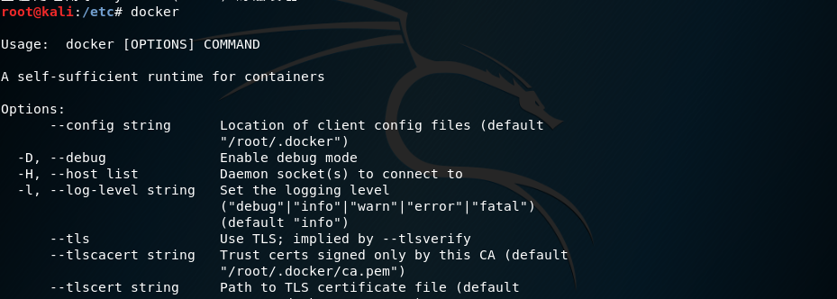
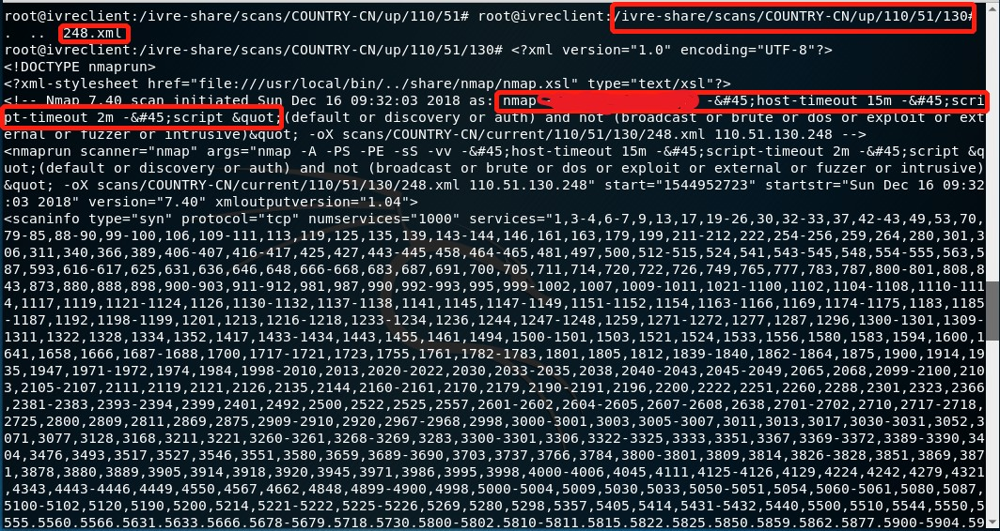

## 开源网络扫描系统 IVRE 搭建及功能测试


**实验环境**:  Kali Linux 虚拟机

### BASIS

- **mkdir**

```
 -m, --mode=MODE		set file mode (as in chmod), not a=rwx - umask
 # -m 1777 <==> 001 111 111 111 
```

```
The permissions passed as an argument to chmod are specified as an octal value. Each numeral in the 
value represents three bits. If three numerals are given, you're setting the read, write and execute 
bits for the file's owner, group and others (everyone else). If four numerals are given, the leftmost
number sets the setuid, setgid and sticky bits. Octal 1 sets the sticky bit. Octal 2 sets the setgid
bit. Octal 2 + octal 1 is octal 3 which sets both the setgid bit and the sticky bit.
```

                                                 
- **Bro基础知识介绍**

  - Bro不是多线程的，因此一旦到达单处理器核心的限制，唯一的选择就是将附在分摊到多核心或者多物理机上。簇部署就是针对这样大系统的场景设计的解决方案。伴随Bro的工具和脚本提供了易于管理许多Bro进程的结构来检查包处理相关动作，从而形成一个整体。
  - Bro 架构
  
  
    - 前端:前端是一个分离的硬件设备或主机技术，能够将流量划分为许多的stream或flow。
    - 管理端:管理端进程有两个主要任务，即从该簇的其他节点接收日志消息以及提示。其输出是一个单一的日志，你需要将某行为和后期处理相结合，你当然可以选择重复提示。管理端进程首先由BroControl启动，仅开放特定端口等待连接，他不会初始任何对其他簇的连接，一旦工作端启动并连接到管理端，日志和提示将开始从工作端抵达管理端进程。
    - 代理端:管理同步状态的进程。变量能够跨进程自动同步。代理端帮助工作端，减轻工作端之间彼此的直连需求。
    - 工作端:工作端嗅探网络流量并做协议分析。活动簇的绝大部分工作发生在工作端上，因此工作端需要最快的内存和CPU速度。但是其硬盘需求不大，因为日志直接发给了管理端。


### Step 0: 安装 docker 

首先 , 在命令行中查看虚拟机是否安装了 docker: 

```
docker
```

 未安装 docker 则输入以下指令：

```
apt-get install docker.io
```

结果如下: 


安装完成后, 输入 docker: 




### Step 1: 安装 IVRE

官网上提供的安装方法：

```
$ mkdir -m 1777 var_{lib,log}_{mongodb,neo4j} ivre-share
$ wget -q https://ivre.rocks/Vagrantfile
$ vagrant up --no-parallel
Bringing machine 'ivredb' up with 'docker' provider...
Bringing machine 'ivreweb' up with 'docker' provider...
Bringing machine 'ivreclient' up with 'docker' provider...
[...]
$ docker attach ivreclient
root@e809cb41cb9a:/# 
```

这里不使用上述方法。需要 agent、base、client、db、web 镜像。输入指令：

```bash
mkdir -m 1777 var_{lib,log}_{mongodb,neo4j} ivre-share
for img in agent base client db web;do
> docker pull "ivre/$img";
> done
```

以上指令等价于 ( Bash 语法 ):

```bash
docker pull ivre/agent
docker pull ivre/base
docker pull ivre/client
docker pull ivre/db
docker pull ivre/web
```

安装完成以后 , docker 开启 database service / web / client:

```
docker run
docker start ivredb
docker start ivreweb
docker start ivreclient
```

通过attach命令进入ivreclient :

```
docker attach ivreclient
```

结果如下：


查看容器:


### Step 2: IVRE 初始化

根据 github 上的 [doc/](https://github.com/cea-sec/ivre/tree/master/doc) :

>## DB creation
>
>Once IVRE has been properly configured, it's time to initialize its databases.
>
>For that, the command-line tools (namely `ivre ipinfo`, `ivre scancli` and `ivre runscansagentdb`, respectively for information about IP addresses, passive information, active information and running scans through agents) have a `--init`option.
>
>So you can run, with a user or from a host where the configuration has a write access to the database (add `< /dev/null` to skip the confirmation):
>
>```
>$ ivre scancli --init
>This will remove any scan result in your database. Process ? [y/N] y
>$ ivre ipinfo --init
>This will remove any passive information in your database. Process ? [y/N] y
># ivre runscansagentdb --init
>This will remove any agent and/or scan in your database and files. Process ? [y/N] y
>```
>
>### Getting IP data
>
>```
># ivre ipdata --download
>$ ivre ipdata --import-all
>```

初始化结果如下:


上面的 Getting IP data 的作用是获取IP位置数据 , ipdata数据包含了IP对应的地理位置信息 , 可以忽略 ( 但是对后面的 Nmap 扫描可能会有影响 , 建议还是下载一下)。现在 , 打开浏览器 , 在地址栏输入:

```
localhost
```

即可打开 `IVRE Web UI` , 效果如下:


在 `IVRE WebUI`  => `help` 上也可以查看帮助信息:

 


### Step 3: IVRE 部分功能测试


#### Flow analysis 


官网上的流量分析借助了工具 bro。安装 bro:

```
apt-get install bro
```

查看 bro 帮助文档:

```
bro --help

-r|--readfile <readfile>       | read from given tcpdump file
-C|--no-checksums              | ignore checksums
```

Bro的事件引擎将丢弃没有有效校验和的数据包。如果想要在系统上分析本地生成/捕获流量，所有发送/捕获的数据包将具有不良的校验和，因为它们尚未由NIC计算，因此这些数据包将不会在Bro策略脚本中进行分析，所以要设置成忽略校验和验证。有以下[解决方案](https://stackoverflow.com/questions/36859896/bro-doesnt-log-outgoing-http-requests):

```
There's at least three ways for Bro to not ignore the packets:

1.Adding the -C flag to bro to ignore checksum validation
2.Setting redef ignore_checksums = T; in $PREFIX/share/bro/site/local.bro to also 
ignore checksum validation. Replacing $PREFIX with the bro installation directory,
often /usr/local/bro.
3.Disable checksum offloading on the NIC using ethtool --offload <int> rx off  tx off
so the correct checksums are generated to begin with. Replacing <int> with the name of
your interface.
```

这里直接选择第 1 种。wireshark 抓包 , 另存为 .pcap 文件格式 , 之后将 .pcap 的数据包放入 docker 的 /ivre-share 文件下 , 指令:

```
docker ps
```


得到 CONTAINER ID : 1b27e881714e。 

```
docker cp test.pcap 1b27e881714e:/ivre-share

# 通用语法
# docker cp src/. mycontainer:/target
# docker cp mycontainer:/src/. target
```

ivreclient 切换到 /ivre-share 文件目录下 , 输入以下指令 :

```
bro -r test.pcap -C				// bro 处理文件 => .log格式
ivre flowcli --init				// 将.log文件导入数据库
ivre bro2db *.log				// 查看导入的流量的统计数据
ivre flowcli --count			
```

使用 `bro -r` 会将数据流划分，并且分摊到多个 `worker`，每个 `worker` 结束工作后，都会得到一个自己所负责模块的 .log 文件，截图如下：


在浏览器中输入 http://localhost/flow.html : 


#### Nmap扫描

查看帮助信息`ivre runscans --help` , 显示如下:

```
usage: ivre runscans [-h] [--categories CAT [CAT ...]] [--country CODE]
                     [--city COUNTRY_CODE CITY]
                     [--region COUNTRY_CODE REGION_CODE] [--asnum AS]
                     [--range START STOP] [--network NET/MASK] [--routable]
                     [--file FILENAME] [--test COUNT]
                     [--zmap-prescan-port ZMAP_PRESCAN_PORT]
                     [--zmap-prescan-opts ZMAP_PRESCAN_OPTS]
                     [--nmap-prescan-ports NMAP_PRESCAN_PORTS [NMAP_PRESCAN_PORTS ...]]
                     [--nmap-prescan-opts NMAP_PRESCAN_OPTS] [--limit LIMIT]
                     [--state STATE STATE STATE STATE]
                     [--nmap-template {default}]
                     [--output {XML,XMLFull,XMLFork,Test,Count,List,ListAll,ListAllRand,ListCIDRs,CommandLine,Agent}]
                     [--processes COUNT] [--nmap-max-cpu TIME]
                     [--nmap-max-heap-size SIZE] [--nmap-max-stack-size SIZE]
                     [--again {up,down,unknown,all} [{up,down,unknown,all} ...]]

Run massive nmap scans.

optional arguments:
  -h, --help            show this help message and exit
  --categories CAT [CAT ...]
                        tag scan results with these categories
  --country CODE, -c CODE
                        select a country
  --city COUNTRY_CODE CITY
                        select a region
  --region COUNTRY_CODE REGION_CODE
                        select a region
  --asnum AS, -a AS     select an autonomous system
  --range START STOP, -r START STOP
                        select an address range
  --network NET/MASK, -n NET/MASK
                        select a network
  --routable
  --file FILENAME, -f FILENAME
                        read targets from a file
  --test COUNT, -t COUNT
                        select COUNT addresses on local loop
  --zmap-prescan-port ZMAP_PRESCAN_PORT
  --zmap-prescan-opts ZMAP_PRESCAN_OPTS
  --nmap-prescan-ports NMAP_PRESCAN_PORTS [NMAP_PRESCAN_PORTS ...]
  --nmap-prescan-opts NMAP_PRESCAN_OPTS
  --limit LIMIT, -l LIMIT
                        number of addresses to output
  --state STATE STATE STATE STATE
                        internal LCG state
  --nmap-template {default}
                        Select Nmap scan template
  --output {XML,XMLFull,XMLFork,Test,Count,List,ListAll,ListAllRand,ListCIDRs,CommandLine,Agent}
                        select output method for scan results
  --processes COUNT     run COUNT nmap processes in parallel (when
                        --output=XMLFork)
  --nmap-max-cpu TIME   maximum amount of CPU time (in seconds) per nmap
                        process
  --nmap-max-heap-size SIZE
                        maximum size (in bytes) of each nmap process's heap
  --nmap-max-stack-size SIZE
                        maximum size (in bytes) of each nmap process's stack
  --again {up,down,unknown,all} [{up,down,unknown,all} ...]
                        select status of targets to scan again
```

输入指令随机扫描 1000 个IP , 默认启用 30 个 Nmap 并行扫描:

```
ivre runscans --routable --limit 1000 --country CN --output=XMLFork
```


扫描过程的打印的输出信息:


扫描时间太久了, 于是改成了 150 个......


扫描完成 , 将扫描结果导入数据库:

```
ivre scan2db -c ROUTABLE,ROUTABLE-CN-001 -s Parrot -r /ivre-share/scans/COUNTRY-CN/up/
```

扫描后的结果保存 `/ivre-share/scans/COUNTRY-CN/up/` , cd 到目录简单地查看一下 ( 不知道为什么命令行中的输入显示不出来......): 


cd 到最后, 会有一个 .xml 文件:



上面的红标显示本次扫描使用的 nmap 命令, 详细的命令也可以使用 `--output CommandLine` 参数查看。如果想要改变默认的扫描规则, 可以通过在`/etc/ivre.conf`增加 `nmap`模板来实现:


之后, 打开 `WebUI`, 显示内容如下：


当然, 也可以使用 `ivre scancli`命令行的方式显示结果。


### 参阅

- [mkdir](https://unix.stackexchange.com/questions/64126/why-does-chmod-1777-and-chmod-3777-both-set-the-sticky-bit)

- [bro]( https://www.bro.org/documentation/faq.html#why-isn-t-bro-producing-the-logs-i-expect-a-note-about-checksums)

- [IVRE官网](https://ivre.rocks/)
- [github doc/](https://github.com/cea-sec/ivre/tree/master/doc)
- [強大的開源網絡偵查工具：IVRE](https://hk.saowen.com/a/9586216e2822cc94043f40c4e0bfef1e18cf07284e6eb6caef23ac1678fb4cd9)
